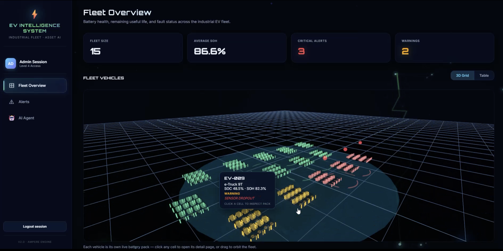
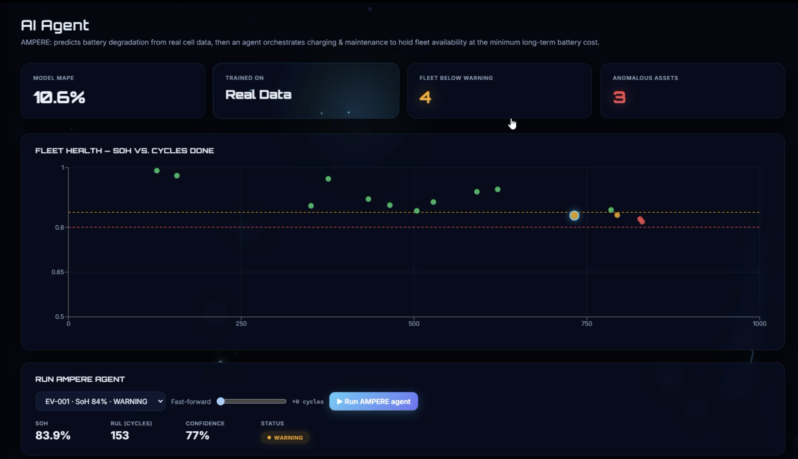
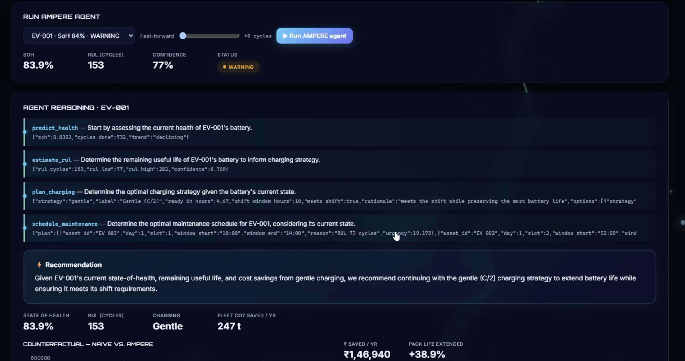
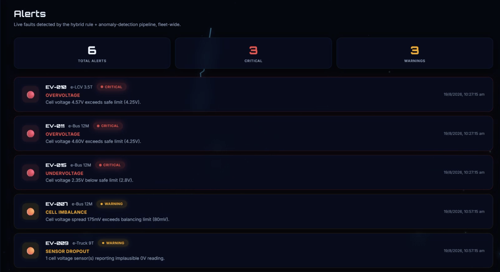
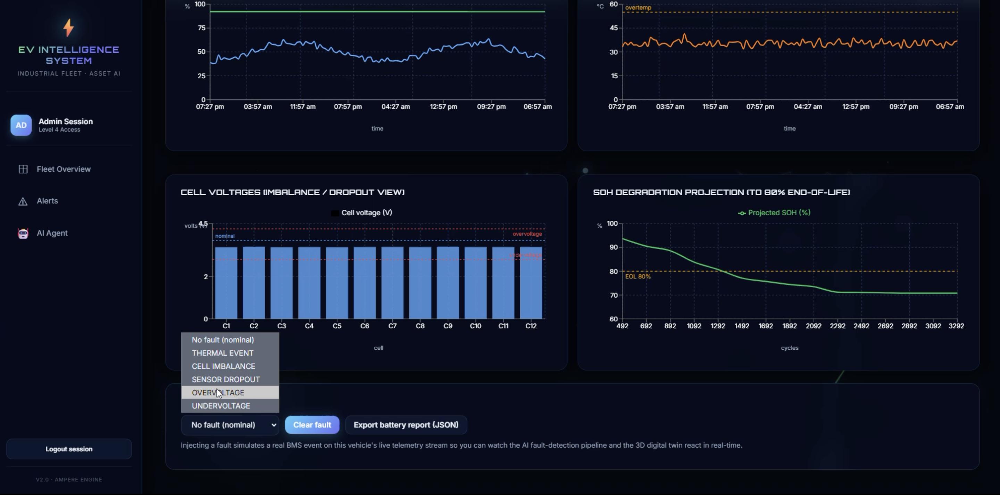
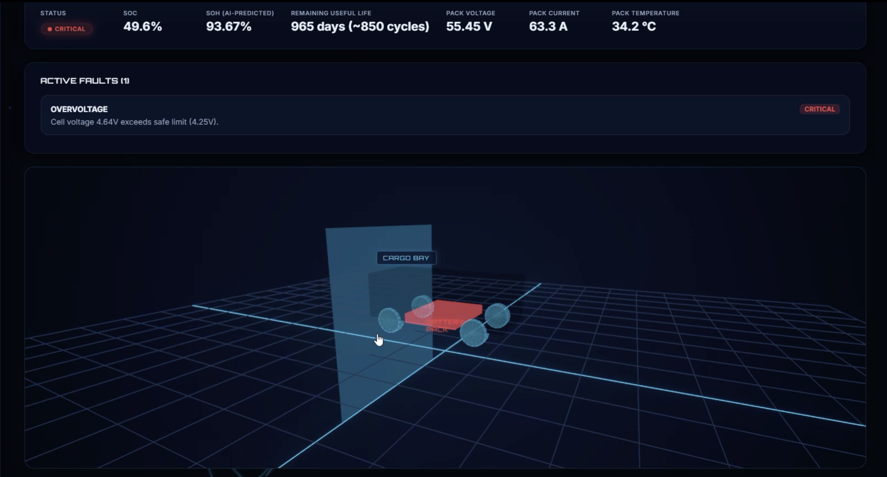
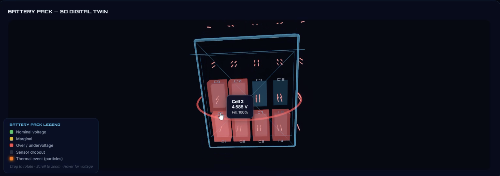
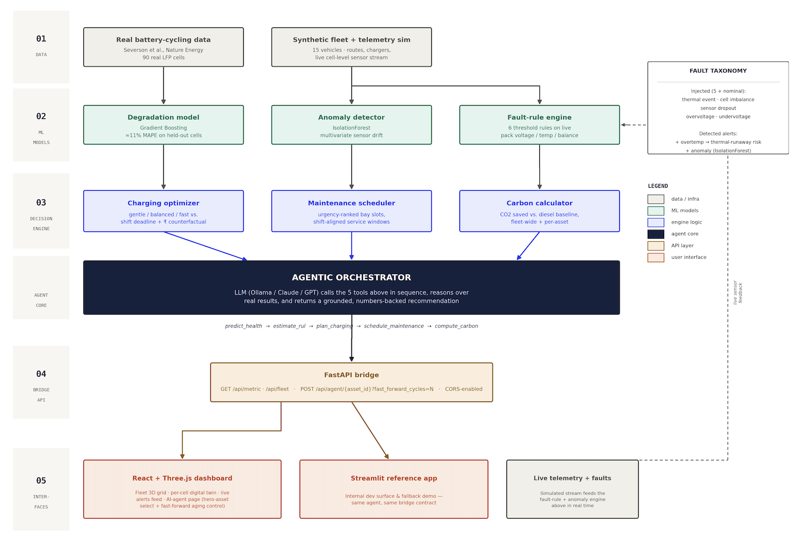

# AMPERE

**AI asset intelligence for industrial EV fleets.** Predicts battery degradation from real cell data, then an agentic AI decides how to charge and maintain every vehicle to hold fleet availability at the lowest long-term battery cost.

Built for the **ET 2.0 AI Hackathon** — Problem Statement 03: *AI for Industrial EV Supply Chain & Asset Intelligence: Accelerating Net Zero*.

[](#) [](#)

---

## The problem

Charging strategy is the one lever that controls both a battery's lifespan and a fleet's operational availability — and the two conflict. Fast-charging keeps a vehicle ready for its next shift but shortens the life of an expensive battery pack. Gentle charging preserves the pack but risks missing the shift. Most fleet tools pick one rule and live with the cost. AMPERE resolves this trade-off per vehicle, per day, and prices the outcome in rupees.

## What it does

| | |
|---|---|
| **Predicts** | Battery state-of-health (SoH) and remaining useful life (RUL), from a model trained on 90 real LFP cells (Severson et al., Nature Energy 2019) — not synthetic data. |
| **Decides** | An LLM-driven agent calls five deterministic tools — health, RUL, charging, maintenance, carbon — and reasons over their real outputs to recommend an action. |
| **Quantifies** | Every recommendation comes with a ₹ counterfactual (naive vs. optimized annual battery cost), pack-life extension %, and CO₂ avoided. |

## Screenshots

**Fleet overview** — every vehicle rendered as its own live battery pack in a 3D grid, color-coded by health status.



**AI Agent page** — live model accuracy, fleet health scatter, and per-vehicle agent controls.



**Agent reasoning** — the full tool-call trace and the grounded recommendation it produces.



**Live alerts** — every fault names the exact threshold it breached.



**Fault injection** — inject a fault live and watch the detection pipeline and SoH projection react in real time.



**Vehicle detail** — per-vehicle stats, active faults, and 3D model.



**Battery pack digital twin** — modeled down to individual cells, each with live voltage and fault state.



## Architecture



- **Data** — 90 real LFP cells (Severson et al.) train the degradation model; a synthetic fleet simulator provides live telemetry.
- **ML models** — Gradient Boosting degradation model (≈11% MAPE), IsolationForest anomaly detector, and a 6-rule fault engine.
- **Decision engine** — charging optimizer (with the ₹ counterfactual), maintenance scheduler (shift-aligned), carbon calculator.
- **Agentic orchestrator** — an LLM calls the five tools above in sequence and returns a grounded recommendation.
- **Bridge API** — FastAPI exposing `/api/metric`, `/api/fleet`, `/api/agent/{asset_id}`.
- **Interfaces** — the React + Three.js dashboard (primary) and a Streamlit reference app (fallback).

## Results (15-vehicle demo fleet)

- **≈11% MAPE** on held-out real cells — comparable to the published benchmark (9–15%)
- **₹1.4–6.8 lakh saved per vehicle/year** in avoided battery-replacement cost, scaling with usage intensity
- **+38.9%** effective pack-life extension from optimized vs. naive charging
- **247 t CO₂/year** avoided fleet-wide vs. a diesel baseline
- **6 fault types** detected via hybrid rule + anomaly-model pipeline

## Getting started

### Backend (ML + agent)

```bash
cd backend
pip install -r requirements.txt
python -m scripts.train              # trains the degradation model on real data
uvicorn api:app --port 8010          # starts the bridge API
```

By default the agent runs in `mock` mode (zero setup). To use a local LLM instead:

```bash
ollama pull qwen2.5:3b
# in backend/.env
LLM_PROVIDER=ollama
LLM_MODEL=qwen2.5:3b
```

Claude and OpenAI are also supported — see `.env.example`.

### Reference UI (Streamlit)

```bash
cd backend
streamlit run app/streamlit_app.py
```

### Frontend (React dashboard)

```bash
cd frontend/ev-battery-intelligence/frontend
npm install
npm run dev
```

```bash
cd frontend/ev-battery-intelligence/backend
pip install -r requirements.txt
uvicorn main:app --port 8000
```

## Tech stack

| Layer | Technology |
|---|---|
| ML / data | scikit-learn, pandas, NumPy |
| Agent / LLM | Ollama (local), Claude, GPT — interchangeable |
| Backend API | FastAPI, Python |
| Frontend | React, Three.js, Vite |
| Reference UI | Streamlit, Plotly |
| Dataset | Severson et al., *Nature Energy* (2019) |

## Dataset & reference

Severson, K.A., Attia, P.M., Jin, H. et al. "Data-driven prediction of battery cycle life before capacity degradation." *Nature Energy* 4, 383–391 (2019). https://doi.org/10.1038/s41560-019-0356-8

Dataset: https://data.matr.io/1/

## Scalability

The 15-vehicle demo fleet is a deliberate demo scope, not a technical ceiling. Every computation — health prediction, RUL, charging optimization, scheduling, carbon — runs per vehicle and is independent of fleet size. The same pipeline that runs on 15 vehicles runs unchanged on several thousand; only the data source feeding the fleet simulator changes.

## Roadmap

- Physics-informed degradation modeling on GPU for further accuracy gains
- Constraint-based (OR-Tools) scheduling across multi-depot bay capacity and technician skills
- Live BMS feed integration in place of the current simulator
- Supply-chain and battery-material traceability (the PS03 pillar not covered in this submission)

## Links

- 🎥 Demo video: *[add link]*
- 📄 Detailed document: *https://drive.google.com/file/d/1OGYyRmRo54StzX5VBS56K7IfeypH-bqo/view?usp=sharing*

## License

MIT
